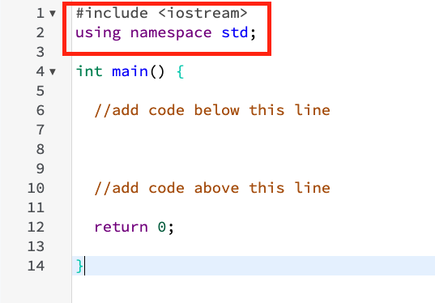
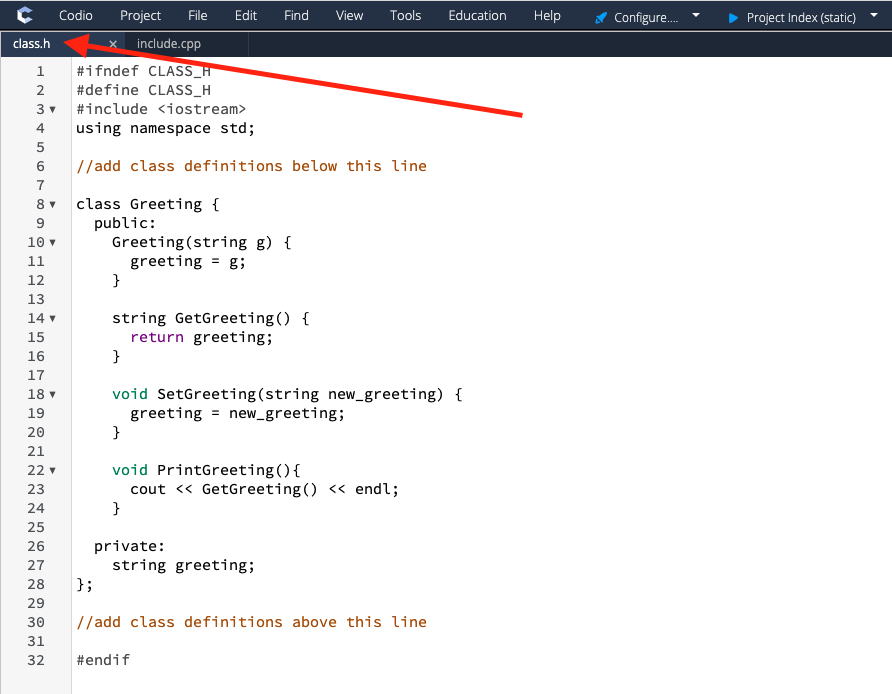
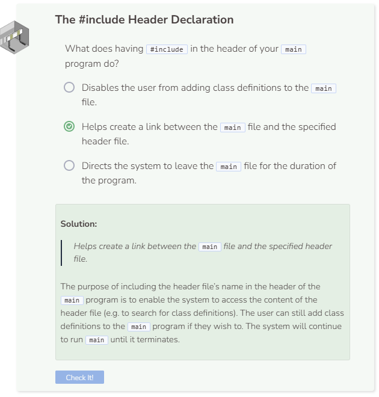

# Using #include
## Objects Defined in Other Files
Now that you’re familiar with creating, manipulating, and inheriting objects, we’ll discuss how these concepts all come together when programs are created. You may have noticed that a lot of the classes that you’ve previously worked with is fairly lengthy. In fact, it’s not typical to include class definitions within the same file as the main program. Usually, classes are defined in other files but they can be accessed by the main program if you set up the correct encapsulation.

## “#include” in the Header
Ever noticed how `#include <iostream>` and `using namespace std;` are usually present in the header of the file? The `#include` directs the system to look for the file or library `iostream`. Then `using namespace std;` enables the system to access functions from the class `std` without having to use the scope resolution operator `::`.



Enter the following into `main` and `Try It`.

```cpp
cout << "Hello world" << endl;
```

Next, comment the header line `using namespace std;` and run the program again.

```cpp
#include <iostream>
//using namespace std;
```

Without `using namespace std;`, the system has no clue which class to look into to use `cout`. Now revise the code in `main` to look like this:

```cpp
std::cout << "Hello world" << std::endl;
```

The scope resolution operator `::` does the same job as `using namespace std;`. Note that you will need to use `std::` in front of every function you decide to call.

## Calling Functions From a Separate File
In the upper left of the text editor window, you will notice a tab that says `class.h`. Click on this tab to see the content of the file.



This is a header file which you can use to store your class definitions. There is some syntax (at the beginning and the end) that you have to include in order to specify that `class.h` is a header file, but ultimately you can reduce the number of code in your main program by creating header files. All header files should have `#ifndef` and `#define` (followed by their file name and then an underscore `_` and `H`) in their header and `#endif` towards the end.

Now, go back into `include.cpp`, copy the entire code below and TRY IT.

```cpp
//#include <iostream>
//using namespace std;
#include "class.h"

int main() {
  
  //add code below this line

  Greeting g("Hello world");
  cout << g.GetGreeting() << endl;
  g.SetGreeting("Hi world");
  cout << g.GetGreeting() << endl;

  //add code above this line
  
  return 0;
  
}
```

Notice how we used `#include "class.h"` in the header of our file. This enables a connection between the main file and the header file `class.h` where the class definitions are found. Also note that because `#include <iostream>` and `using namespace std;` are already included in `class.h`, you can comment out or remove them in the main program.

