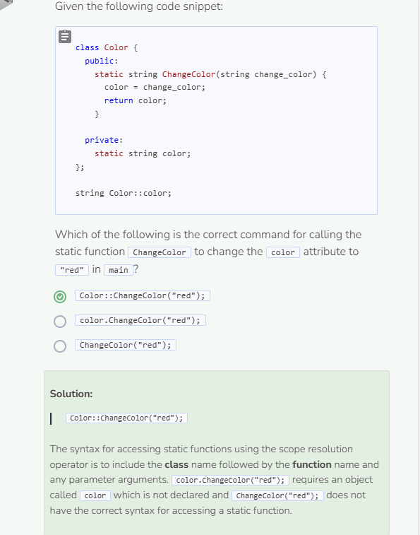

# Static Variables & Functions
## Manipulating Non-Object Variables
Throughout this course, we’ve been creating class objects through the use of a constructor, which is required in order for an object to access certain class functions. However, if we want to manipulate a particular class attribute without having to instantiate that particular object, you can use a combination of the `static` keyword plus the scope resolution operator `::` to manipulate attributes.

```cpp
#include <iostream>
using namespace std;

//add class definitions below this line

class Player {
  public:
    Player() {
      health = 100;
      score = 0;
    }
    void PrintLevel() {
      cout << level << endl;
    }
    static int ChangeLevel(int change) { //define static function
      level = change;
      return level;
    }
  
  private:
    int health;
    int score;
    static int level; //declare static variable
};

//add class definitions above this line

int Player::level = 0; //initalize static variable globally

int main() {
  
  //add code below this line

  Player mario;
  mario.PrintLevel(); //calling class function, object required
  cout << Player::ChangeLevel(5) << endl; //calling static function, object not needed
  
  //add code above this line
  
  return 0;
  
}
```

Notice how when calling the `ChangeLevel` function, we needed the class name `Player` followed by the scope resolution operator `::` followed by the function name `ChangeLevel` and any parameter arguments. Calling a `static` function enabled us to change the attribute `level` to `5` without calling the function on the object itself.

When defining and calling `static` functions, keep the following in mind:
* Within a class, `static` functions can only access other `static` members; for example, if `level` was not a `static` variable in the example above, `ChangeLevel` would not be able to access it.
* A `static` variable should be defined or initialized globally outside of any class or function. In other words, a `static` variable should not be initialized within a class or within the main function.
* Use the scope resolution operator `::` as defined above to access `static` functions that modify `static` variables.

## Static Variables
It’s important to note that static variables are variables that are created only once. They cannot be created again for the duration of the program. The following code will showcase how the static variable `level` works throughout the program.

```cpp
#include <iostream>
using namespace std;

//add class definitions below this line

class Player {
  public:
    Player() {
      health = 100;
      score = 0;
    }
    void PrintLevel() {
      cout << level << endl;
    }
    static int ChangeLevel(int change) {
      level = change;
      return level;
    }
  
  private:
    int health;
    int score;
    static int level;
};

//add class definitions above this line  

int Player::level = 5; //initialize static variable level to 5

int main() {
  
  //add code below this line

  Player mario;
  mario.PrintLevel();
  cout << Player::ChangeLevel(6) << endl;
  Player luigi;
  luigi.PrintLevel();
  
  //add code above this line
  
  return 0;
  
}
```

Again, note that static variables are initialized outside of a class globally. This is to prevent the variable from being duplicated. By definition, static variables are only created once. This is why when the `Player` object `luigi` is created, its level attribute is the same as `mario`'s even though its level was never changed. Essentially, both objects share the same static variable `level`. Changes made to `level` will be reflected in all objects that have that attribute.


