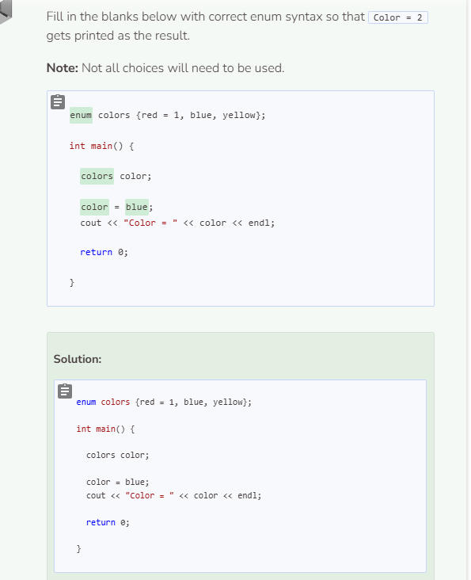
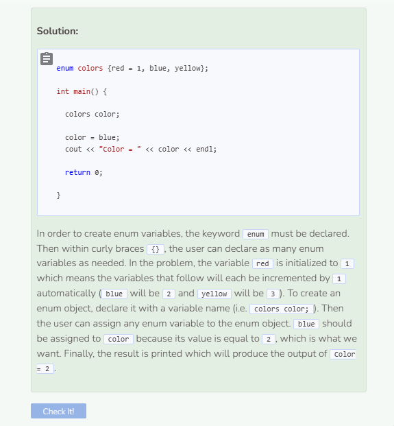

# Structs & Enums
## What are Structs?
Structs are like classes, except everything inside a struct is **public**. Therefore, anything external to the struct can alter its members. For example:

```cpp
//add class definitions below this line

struct Person {
    string name;
    int age;
    double salary;
};

//add class definitions above this line

int main() {
  
  //add code below this line

  Person p;
  p.age = 50;
  cout << p.age << endl;

  //add code above this line
  
  return 0;
  
}
```

In the example above, after creating the `struct` called `Person`, we are able to access the `age` attribute by simply using dot notation and specifying the attribute. If security is not an issue, structs are useful at putting together a collection of attributes that are highly modifiable and accessible.

## Setting Values with Enums
Enums are similar to **switch-case** statements where particular values are assigned to particular cases. See example below:

```cpp
//add class definitions below this line

enum grades {A = 90, B = 80, C = 70, D = 60};

//add class definitions above this line

int main() {
  
  //add code below this line

  grades grade;

  grade = A;
  cout << "Grade = " << grade << endl;

  //add code above this line
  
  return 0;
  
}
```

Cases (variables) of the alphabet from A through D have been assigned to variable integers from 90 backwards to 60 in increments of 10. When you create a `grades` enum, you can assign it to any of the cases specified in the enum definition. This will signal to the system to assign the `grades` enum to appropriate integer equivalent.

Enum values must be integers. For example, you can’t create an enum with string values.

If the enum variables are not assigned values, the first variable will be 0 by default. The second variable will be 1 and so on. Additionally, the incrementation of 1 happens following the first value of the initialized enum variable. For example, `enum fruit {apple = 5, banana, orange};` causes apple to have a value of 5 and each variable after will have a value incremented by 1. This means `banana` will have a value of 6 and `orange` will have a value of 7. On the other hand, `enum fruit {apple, banana = 5, orange};` causes `apple` to be 0, `banana` to be 5, and `orange` to be 6.



