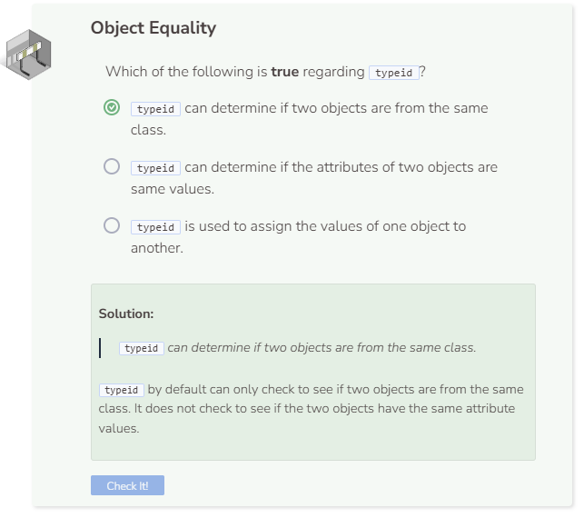

# Object Equality
## Comparing Object Types
You can compare object types by implementing the `typeid` function. For example, the code below showcases the comparison between two `Player` objects called `mario` and `luigi` using `typeid`.

```cpp
//add class definitions below this line

class Player {
  public:
    Player() {
      health = 100;
      score = 0;
      level = 1;
    }
  
  private:
    int health;
    int score;
    int level;
};

//add class definitions above this line  

int main() {
  
  //add code below this line

  Player mario;
  Player luigi;
  cout << boolalpha;
  cout << (typeid(mario) == typeid(luigi)) << endl;
  
  //add code above this line
  
  return 0;
  
}
```

Since both `mario` and `luigi` are of the class `Player`, their `typeid` will be the same. This is why `cout << (typeid(mario) == typeid(luigi)) << endl;` returns `true`. Unfortunately, `typeid` does not check to ensure that both objects contain the same exact attribute values. However, you can create a user-defined class to check for that.

## Comparing Same-Class Objects
Let’s create a static member function called `ComparePlayers`. This function takes in two `Player` objects as parameters, then checks to see if each of their attributes is equal to the other. If their attributes are equal, `true` is returned. Else, `false` is returned. Another member function called `NextLevel` is also created.

```cpp
//add class definitions below this line

class Player {
  public:
    Player() {
      health = 100;
      score = 0;
      level = 1;
    }
  
    static bool ComparePlayers(Player p1, Player p2) {
      if ((p1.health == p2.health) &&
          (p1.score == p2.score) &&
          (p1.level == p2.level)) {
        return true;
      }
      else {
        return false;
      }
    }
  
    void NextLevel() {
      level++;
    }
  
  private:
    int health;
    int score;
    int level;
};

//add class definitions above this line 

int main() {
  
  //add code below this line

  Player mario;
  Player luigi;
  cout << boolalpha;
  cout << Player::ComparePlayers(mario, luigi) << endl;
  
  //add code above this line
  
  return 0;
  
}
```

Notice how when `mario`'s level changed, the `ComparePlayers` function returns `false` when `mario` and `luigi` are compared.


