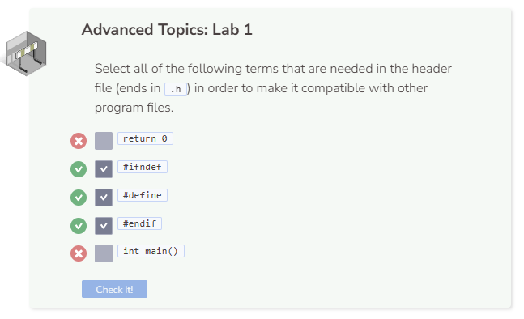

# Lab 1
## Lab 1
In this module, we’ve learned how to create separate header files so that we can call them without having to place them into the `main` file. This will dramatically reduce the length of code needed in the `main` file. Make sure your main file (`lab1.cpp`) and your header file (`class.h`) contain the code below.

```cpp
#include "class.h"

int main() {
  
  //add code below this line

  Greeting g("Hello world");
  cout << g.GetGreeting() << endl;
  g.SetGreeting("Hi world");
  cout << g.GetGreeting() << endl;

  //add code above this line
  
  return 0;
  
}
```

```cpp
#ifndef CLASS_H
#define CLASS_H
#include <iostream>
using namespace std;

//add class definitions below this line

class Greeting {
  public:
    Greeting(string g) {
      greeting = g;
    }
  
    string GetGreeting() {
      return greeting;
    }
  
    void SetGreeting(string new_greeting) {
      greeting = new_greeting;
    }
  
    void PrintGreeting(){
      cout << GetGreeting() << endl;
    }
  
  private:
    string greeting;
};

//add class definitions above this line

#endif
```

Now, try to add to the existing `class.h` by including a class called `Farewell`. This class should include all of the equivalent functions of `Greeting`.

For example, if:

```cpp
  Farewell f("Goodbye world");
  cout << f.GetFarewell() << endl;
  f.SetFarewell("Bye world");
  cout << f.GetFarewell() << endl;
```


