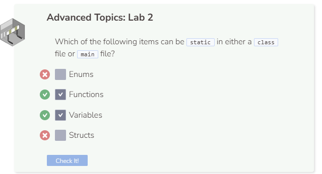

# Lab 2
## Lab 2
You are provided the following header and main files:

point.h
```cpp
#ifndef SLOPE_H
#define SLOPE_H

//add definitions below this line


//add definitions above this line

#endif
```

slope.h
```cpp
#ifndef SLOPE_H
#define SLOPE_H

//add definitions below this line


//add definitions above this line

#endif
```

lab2.cpp
```cpp
#include <iostream>
using namespace std;
#include "point.h"
#include "slope.h"

int main() {
  
  //add code below this line


  //add code above this line
  
  return 0;
  
}
```

In this lab, you’ll be working with these three files. The idea is to create a struct called point within `point.h`, then create a static function called `CalculateSlope` within `slope.h`, and finally run a few commands within `lab2.cpp` to print some results.

## point.h
In this header file, we will create a struct called `point` which contains just two attributes, `int x` and `int y`. Remember, structs are public by default which means they are easily accessible.

```cpp
//add definitions below this line

struct point {
  int x;
  int y;
};

//add definitions above this line
```

## slope.h
In this header file, we will create a class called Slope. This class only has one static member function called ``CalculateSlope``. CalculateSlope takes in two point structures and returns the calculated slope between them.
```cpp
//add definitions below this line

class Slope {
  public:
    static double CalculateSlope(point a, point b) {
      return ( (double) (b.y - a.y) / (double) (b.x - a.x) );
    }
};

//add definitions above this line
```

## lab2.cpp
Now it’s time to test our header files within `main`. We are going to create two `point` structures, assign values to their attributes, then call `CalculateSlope` on the two points. Note that we do not need to create a `Slope` object before calling `CalculateSlope` since it is a static function. Simply use the scope resolution operator `::` to access the function as shown in the code below.

```cpp
  //add code below this line

  point a;
  point b;
  a.x = 0;
  a.y = 0;
  b.x = 2;
  b.y = 2;
  cout << Slope::CalculateSlope(a, b) << endl;

  //add code above this line
```

Note that including the header files produces the same result as including the struct `point` and class `Slope` within `main`. However, the header files enable the main program to be less cluttered with definitions.




